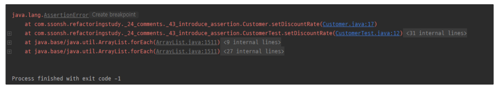
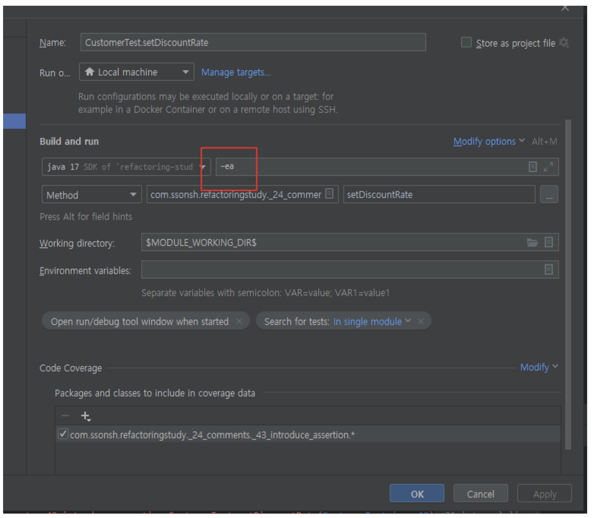

# 리팩토링 43. 어서션 추가하기

**냄새** : 주석

→ **“어서션 추가하기”** 를 통해 리팩토링 할 수 있다.

**어서션 추가하기 (Introduce Assertion)**

- 종종 코드로 표현하지 않았지만 **`기본적으로 가정하고 있는 조건들`**이 있다.
  그런 조건을 알고리즘을 파악하거나 주석을 읽으면서 확인할 수 있다.
    - *ex. 전달되는 인자, 혹은 지금 이 변수는 “양수”일 것이다! 라고 가정하는 것*
- 그러한 조건을 Assertion을 사용해서 보다 명시적으로 나타낼 수 있다.
- Assertion은 if나 switch 문과 달리 *“항상” true 이길 기대하는 조건을 표현할 때 사용한다.*
    - 프로그램이 Assertion에서 **`실패한다면 프로그래머의 실수`**로 생각할 수 있다.
    - Assertion이 없어도 프로그램이 동작해야 한다.
        - 자바에서는 컴파일 옵션으로 assert 문을 사용하지 않도록 설정할 수도 있다.
- 특정 부분에선 특정한 상태를 가정하고 있다는 것을 명시적으로 나타냄으로써, 의사소통적인 가치를 지니고 있다.

---

아래 코드를 살펴보자.

Customer.java

```java
package com.ssonsh.refactoringstudy._24_comments._43_introduce_assertion;

public class Customer {

    private Double discountRate;

    public double applyDiscount(double amount) {
        return (this.discountRate != null) ? amount - (this.discountRate * amount) : amount;
    }

    public Double getDiscountRate() {
        return discountRate;
    }

    public void setDiscountRate(Double discountRate) {
        this.discountRate = discountRate;
    }
}
```

- 위 코드에서 **`applyDiscount`** 메서드에서 **`discountRate`** 는 양수일 것이라는 것을 가정하고 있다.
- 그렇다면 `**discountRate**` 값을 설정하는 부분에서 양수만 설정될 수 있도록 assert 문을 적용할 수 있다.

    ```java
    public void setDiscountRate(Double discountRate) {
        assert discountRate != null && discountRate > 0;
        this.discountRate = discountRate;
    }
    ```


위에서도 언급하였지만 Java에서는 컴파일 시 Assertion문이 제거되고 컴파일 된다.

즉, 이 Assertion에 기대어 비즈니스 로직을 구현하면 안된다! 실제 동작에서는 걸러지지 않는것이다.

→ 그러나 Test 코드로 구동할 때에는 Assertion 문이 제거되지 않고 활성화 되어 있다.

**CustomerTest.java**

```java
class CustomerTest {

    @Test
    void setDiscountRate(){
        Customer customer = new Customer();
        customer.setDiscountRate(-100d);
    }

}
```



왜 Test 코드에선 Assertion이 동작할까?

→ ***“`—ea`” 라는 JVM Option이 포함되어 있기 때문이다. (Enable Assertion)***



그럼 저 옵션을 제거한다면?!

- Assertion과 관련된 내용이 제거되어 프로그램이 실행되면서
- 정상적으로 성공되어 버린다.